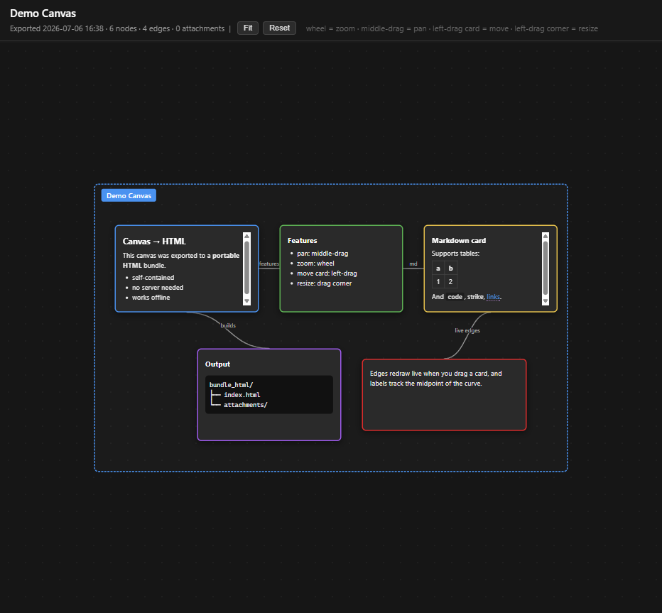

# Obsidian-CanvasToHtml

[简体中文](./README.zh-CN.md) | **English**

> Export an Obsidian **`.canvas`** into a portable, self-contained HTML bundle — with an `attachments/` folder carrying every referenced note and image.




Turn this:

```
my-note.canvas   (JSON produced by Obsidian's Canvas core plugin)
```

into this:

```
my-note_html/
├── my-note.html          ← open in any browser, fully offline
└── attachments/
    ├── note1.md
    ├── note2.md
    ├── figure1.png       ← embedded inline
    └── figure2.png
```

The exported page is an interactive, pan/zoom recreation of your canvas: groups as dashed containers, text cards rendered as Obsidian-flavour markdown, file cards with their `.md` content or embedded image, and edges drawn as labelled bezier curves. Drop the folder on a USB stick, email it, host it statically — no Obsidian, no server, no internet needed.

---

## ✨ Features

- **Faithful layout** — preserves the canvas coordinate system, colours, group nesting, and edge routing from the original `.canvas`.
- **Portable by design** — every referenced note and image is copied into `attachments/`; the HTML uses only relative URLs.
- **Obsidian-flavour markdown** — tables, fenced code with syntax-highlight classes, task lists, wikilinks `[[target]]`, and `![[image.png]]` embeds all render.
- **Interactive** — middle-drag to pan, wheel to zoom (cursor-centric), left-drag a card to move it, left-drag the bottom-right corner to resize. Edges and their labels follow live.
- **Missing-file safe** — a broken vault path renders as a labelled placeholder instead of crashing the export.
- **Zero network** — the converter is a single Python script with no HTTP calls; safe to run offline.

---

## 📦 Install

### As a ZCode / Claude Code skill

This repo *is* the skill. Clone it into any skill discovery directory:

```bash
# user-wide (available in every project)
git clone https://github.com/TIGERwu0118/Obsidian-CanvasToHtml.git \
  ~/.zcode/skills/Obsidian-CanvasToHtml

# or project-local
git clone https://github.com/TIGERwu0118/Obsidian-CanvasToHtml.git \
  ./.zcode/skills/Obsidian-CanvasToHtml
```

Then just say *"export this canvas to html"* and the skill triggers. See [`SKILL.md`](./SKILL.md) for the full trigger list and agent workflow.

### As a standalone script

No skill loader needed — the converter is a plain CLI:

```bash
git clone https://github.com/TIGERwu0118/Obsidian-CanvasToHtml.git
cd Obsidian-CanvasToHtml
pip install -r requirements.txt
python scripts/canvas_to_html.py path/to/my.canvas
```

---

## 🚀 Usage

```bash
python scripts/canvas_to_html.py <input.canvas> [options]
```

| flag | purpose |
|------|---------|
| `<canvas>` *(positional)* | Path to the `.canvas` file. Required. |
| `--vault-root DIR` | Obsidian vault root. Auto-detected via `.obsidian/` if omitted. |
| `--output-dir DIR` | Output directory. Defaults to `<canvas-stem>_html/` next to the canvas. |
| `--title TEXT` | HTML `<title>` and topbar heading. Defaults to canvas filename stem. |
| `--open` | Open the result in the default browser when done. |

### Examples

```bash
# basic — output goes to ./report_html/
python scripts/canvas_to_html.py report.canvas

# custom output location + title
python scripts/canvas_to_html.py report.canvas \
  --output-dir ./site/report \
  --title "Q3 Research Map"

# canvas lives outside a vault — pass the vault root explicitly
python scripts/canvas_to_html.py ~/Downloads/notes.canvas \
  --vault-root ~/Obsidian/MyVault
```

---

## 🖱️ Interaction cheat sheet

| Action | Control |
|---|---|
| **Pan canvas** | Middle-mouse drag *(works anywhere — over cards, handles, or empty space)* |
| **Move a card** | Left-drag the card body |
| **Resize a card** | Left-drag the bottom-right corner handle *(appears on hover)* |
| **Zoom** | Mouse wheel *(cursor-centric)* |
| **Fit all** | `Fit` button in the top bar |
| **Reset view** | `Reset` button |

---

## 🧠 How it works

1. **Parse** the `.canvas` JSON (`nodes[]` + `edges[]`).
2. **Resolve the vault root** by walking parents of the canvas looking for `.obsidian/`.
3. **Render** each node:
   - `group` → dashed container with a coloured label
   - `text` → Obsidian-flavour markdown (via `python-markdown` + `pymdown-extensions`)
   - `file` → if image, embed inline; if `.md`, render its content and copy the source; otherwise link
   - `link` → external anchor
4. **Copy** every referenced file into `attachments/` (dedup by name + size).
5. **Emit** a single HTML file embedding all CSS + JS, plus the `attachments/` folder.

The viewport is an absolutely-positioned node layer transformed by a single CSS `translate()+scale()`; the SVG edge layer shares the same transform so they pan/zoom in lockstep. Edge geometry is recomputed live as cards move or resize, and each edge's text label is repositioned to the bezier midpoint (t=0.5) so it always tracks the curve.

---

## 📁 Project layout

```
Obsidian-CanvasToHtml/
├── SKILL.md                       # skill definition (trigger + agent workflow)
├── README.md                      # English (you are here)
├── README.zh-CN.md                # 简体中文
├── LICENSE                        # MIT
├── requirements.txt               # markdown, pymdown-extensions, Pygments
└── scripts/
    └── canvas_to_html.py          # the converter (single file, ~800 lines)
```

A worked example output lives in [`examples/`](./examples/) (see its README for how to reproduce).

---

## ⚙️ Requirements

- **Python 3.9+**
- `markdown >= 3.7`
- `pymdown-extensions >= 10`
- `Pygments >= 2.18` *(only for code-highlight CSS classes)*

All listed in [`requirements.txt`](./requirements.txt). Standard library only otherwise.

---

## 📝 Notes & caveats

- The canvas coordinate system uses Obsidian's pixel units; negative coordinates are normal. The exporter computes a bounding box and auto-fits on load.
- Wikilinks `[[Target]]` become in-page anchors that jump to the matching card id (best-effort; works when the target note is also a node on the same canvas).
- Excalidraw-drawn canvases (`.excalidraw.md` pretending to be canvas) are **not** supported — only native `.canvas` JSON.
- Very large canvases (hundreds of nodes) still work, but the initial layout pass is O(n); the in-browser view itself is cheap.

---

## 📄 License

MIT — see [`LICENSE`](./LICENSE).
